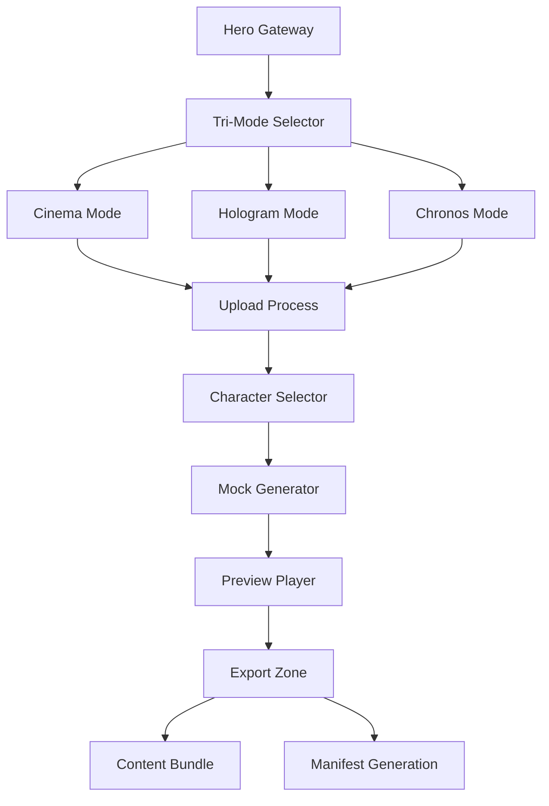

## 1. Product Overview
PARADOX is a revolutionary single-page interactive web application that transforms educational content into immersive, cinematic learning experiences. This type-10 civilization UI system converts PDFs and notes into three distinct modes: cinematic mini-films, holographic AI teachers, and timeline-based chrono-travel experiences.

The product solves the problem of passive, boring learning by creating engaging, interactive educational content that feels like stepping into a hyper-advanced civilization's learning interface. Students, educators, and self-learners can upload their materials and watch reality bend into personalized learning experiences.

## 2. Core Features

### 2.1 User Roles
| Role | Registration Method | Core Permissions |
|------|---------------------|------------------|
| Visitor | No registration required | Upload content, preview modes, generate mock experiences |
| User | Optional email registration | Save preferences, export content bundles |

### 2.2 Feature Module
Our interdimensional learning interface consists of the following essential components:

1. **Hero Gateway**: Cosmic entry portal with animated background and dimensional entry CTA
2. **Tri-Mode Selector**: Quantum tabs for Cinema, Hologram, and Chronos modes
3. **Mode Panels**: Crystalized panels for each learning mode with specific controls
4. **Upload Process**: Dimensional extraction chamber for content processing
5. **Character Selector**: Avatar and personality configuration system
6. **Mock Generator**: Deterministic content processing simulation
7. **Preview Player**: Interactive learning experience player
8. **Export Zone**: Content bundle download and manifest generation

### 2.3 Page Details
| Page Name | Module Name | Feature description |
|-----------|-------------|---------------------|
| Hero Gateway | Animated Background | Loop cosmic pulse video with floating fractal rings around PARADOX logo |
| Hero Gateway | Headline Section | Display "PARADOX — Learn Across Dimensions" with subheading and dual CTAs |
| Hero Gateway | Entry Controls | Primary CTA "ENTER PARADOX" and secondary "WATCH 30s PREVIEW" buttons |
| Tri-Mode Selector | Quantum Tabs | Three glowing tabs with particle shimmer transitions between Cinema, Hologram, Chronos |
| Cinema Mode Panel | Preview Player | Left-side placeholder video player with script preview and character controls |
| Cinema Mode Panel | Content Controls | Mid-scene questions, branching narrative, narration voice tone, intensity slider |
| Hologram Mode Panel | AR Teacher Preview | Floating holographic teacher card with table placement mock view |
| Hologram Mode Panel | Gesture Timeline | Visual representation of teacher gestures and interactions |
| Hologram Panel | Teacher Controls | Personality selection, hologram scale, diagram projection settings |
| Chronos Mode Panel | Cosmic Timeline | Scrollable timeline with glowing nodes showing concept thumbnails and timestamps |
| Chronos Mode Panel | Node Interaction | Click nodes to reveal scene preview cards with mini content |
| Chronos Mode Panel | Timeline Controls | Depth slider and event density toggle for timeline customization |
| Upload Process | File Acceptance | Support PDF, DOCX, TXT, and pasted text with drag-and-drop interface |
| Upload Process | Extraction Animation | Show glowing compression with fractal growth and ripple pulse effects |
| Upload Process | Processing Steps | Simulate Extract → Outline → Script → Scene Map progression |
| Character Selector | Auto-Select Option | Content-based character recommendation system |
| Character Selector | Avatar Library | Six pre-designed character avatars with preview cards |
| Character Selector | Custom Creator | Name, personality, tone (serious/funny/sarcastic), style (realistic/anime/cosmic) |
| Mock Generator | Processing Animation | 2.5 second cosmic animation with deterministic JSON output |
| Mock Generator | Output Generation | Create mock_outline.json, mock_scenes.json, mock_questions.json, asset_map.json |
| Preview Player | Interactive Playback | Auto-pause at question timestamps with floating overlay |
| Preview Player | Answer Feedback | Green holographic pulse for correct, soft shake + explanation for wrong |
| Preview Player | Question System | Multiple choice questions with automatic resume after answer |
| Chronos Mini-Map | Timeline Navigation | Optional scrollable timeline beneath preview for quick navigation |
| Export Zone | Content Bundle | Download mock JSON files as ZIP package |
| Export Zone | Manifest Generation | Create manifest.json for real generation preparation |
| Export Zone | State Reset | "Reset Universe" button to clear all application state |

## 3. Core Process

### Visitor Flow
1. User lands on Hero Gateway with cosmic animated background
2. Clicks "ENTER PARADOX" to access the main interface
3. Selects learning mode via quantum tabs (Cinema/Hologram/Chronos)
4. Uploads educational content through dimensional extraction chamber
5. Configures character and mode-specific settings
6. Triggers mock generation with cosmic processing animation
7. Interacts with preview player and embedded questions
8. Exports content bundle or prepares real generation manifest

### User Flow (Registered)
1. Same initial flow as visitor
2. Additional ability to save preferences and character configurations
3. Access to personalized content recommendations
4. Enhanced export options and manifest generation

## 4. User Interface Design

### 4.1 Design Style
- **Primary Colors**: Deep Cosmos Black (#06070A), Quantum Cyan (#00F0FF), FTL Magenta (#FF2DD7)
- **Secondary Colors**: Plasma Violet (#8C4BFF), Stardust White (#F3F8FF), Ether Glass (rgba(255,255,255,0.06))
- **Typography**: Cinzel/Playfair Display SC for headlines, Inter for body text
- **Button Style**: Glass morphic with soft neon rims and holographic gradients
- **Layout Style**: Dimensional layering with foreground, midlayer, and deeplayer panels
- **Icon Style**: Minimal cosmic symbols with particle trail effects

### 4.2 Page Design Overview
| Page Name | Module Name | UI Elements |
|-----------|-------------|-------------|
| Hero Gateway | Animated Background | Low-cost cosmic pulse webm loop with floating fractal rings in Quantum Cyan |
| Hero Gateway | Logotype | PARADOX text with dimensional shadow and FTL Magenta glow |
| Hero Gateway | CTAs | Glass buttons with neon shockwave ripple on hover, Plasma Violet accent |
| Tri-Mode Selector | Quantum Tabs | Horizontal tabs with particle shimmer transitions, breathing animation |
| Cinema Panel | Preview Player | Rounded corners with Ether Glass overlay, cyan progress indicator |
| Cinema Panel | Controls | Sliders with cosmic glow, toggle switches with holographic feedback |
| Hologram Panel | AR Card | Floating 3D effect with subtle rotation, table placement grid |
| Hologram Panel | Timeline | Horizontal gesture bar with glowing nodes and smooth transitions |
| Chronos Panel | Timeline | Vertical scrollable timeline with cosmic nodes, depth-based scaling |
| Upload Process | Animation | Fractal growth patterns with ripple pulses, deterministic progression |
| Character Selector | Avatar Cards | Circular portraits with personality badges, hover effects |
| Preview Player | Question Overlay | Semi-transparent modal with dimensional warping entrance |
| Export Zone | Buttons | Glass morphic with download icons, state reset with cosmic theme |

### 4.3 Responsiveness
- **Desktop-First Design**: Optimized for 1920x1080 and larger displays
- **Mobile Adaptive**: Responsive breakpoints at 768px and 480px
- **Touch Interaction**: Enhanced touch targets and swipe gestures for mobile
- **Parallax Optimization**: Reduced motion effects on mobile devices for performance