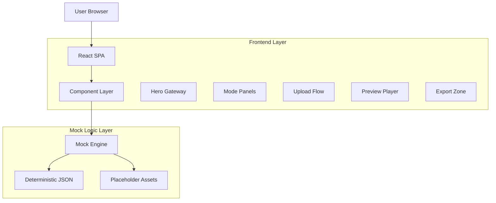
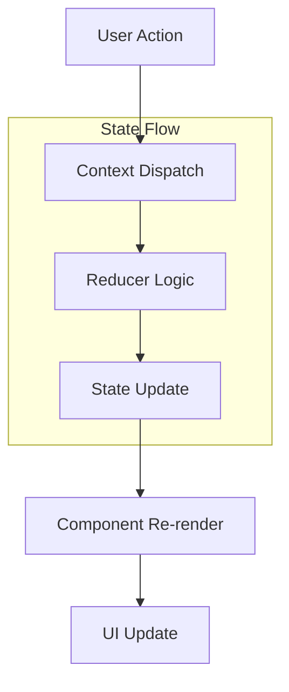

## 1. Architecture Design



## 2. Technology Description
- **Frontend**: React@18 + TailwindCSS@3 + Vite
- **Initialization Tool**: vite-init
- **Animation Library**: Framer Motion
- **State Management**: React Context + useReducer
- **File Processing**: Client-side FileReader API
- **Backend**: None (Zero backend dependencies)

## 3. Route Definitions
| Route | Purpose |
|-------|---------|
| / | Single-page application with all components |
| /preview | Optional full-screen preview mode (hash-based routing) |

## 4. Component Architecture

### 4.1 Core Components
```typescript
// Main App Structure
interface AppState {
  currentMode: 'cinema' | 'hologram' | 'chronos';
  uploadedFile: File | null;
  extractedContent: string;
  mockData: MockDataBundle;
  characterConfig: CharacterConfig;
  isGenerating: boolean;
  previewActive: boolean;
}

interface MockDataBundle {
  outline: OutlineData;
  scenes: SceneData[];
  questions: QuestionData[];
  assetMap: AssetMapData;
}

interface CharacterConfig {
  name: string;
  personality: string;
  tone: 'serious' | 'funny' | 'sarcastic';
  style: 'realistic' | 'anime' | 'cosmic';
}
```

### 4.2 Mock Generation Logic
```typescript
// Deterministic mock generation
class MockEngine {
  generateMockData(content: string, mode: string): MockDataBundle {
    const title = this.extractTitle(content);
    const sections = this.generateSections(content);
    const scenes = this.generateScenes(sections, mode);
    const questions = this.generateQuestions(scenes);
    
    return {
      outline: { title, sections },
      scenes,
      questions,
      assetMap: this.generateAssetMap(scenes, mode)
    };
  }
  
  private extractTitle(content: string): string {
    return content.split('\n')[0] || "Untitled Learning Journey";
  }
  
  private generateSections(content: string): Section[] {
    // Deterministic section generation based on content length
    const wordCount = content.split(' ').length;
    const sectionCount = Math.min(Math.max(Math.floor(wordCount / 200), 2), 5);
    
    return Array.from({ length: sectionCount }, (_, i) => ({
      id: `sec${i + 1}`,
      heading: `Chapter ${i + 1}: Key Concepts`,
      bullets: this.generateBullets(content, i)
    }));
  }
}
```

## 5. State Management Flow


## 6. Asset Management

### 6.1 Placeholder Assets Structure
```
public/
├── assets/
│   ├── previews/
│   │   ├── cinema.mp4
│   │   ├── hologram.mp4
│   │   └── chronos.mp4
│   ├── characters/
│   │   ├── avatar1.png
│   │   ├── avatar2.png
│   │   └── ... (6 total)
│   ├── backgrounds/
│   │   ├── cosmic-pulse.webm
│   │   └── fractal-ring.svg
│   └── icons/
│       ├── quantum-cyan.svg
│       └── ftl-magenta.svg
```

### 6.2 Mock JSON Schema
```typescript
// mock_outline.json
interface OutlineData {
  title: string;
  sections: Array<{
    id: string;
    heading: string;
    bullets: string[];
  }>;
}

// mock_scenes.json
interface SceneData {
  id: string;
  start: number;
  duration: number;
  text: string;
}

// mock_questions.json
interface QuestionData {
  scene_id: string;
  time: number;
  text: string;
  options: string[];
  answer_index: number;
}

// asset_map.json
interface AssetMapData {
  mode: 'Cinema' | 'Hologram' | 'Chronos';
  scene_to_clip: Record<string, string>;
}
```

## 7. Animation System

### 7.1 Motion Specifications
```typescript
// Easing curves
const easing = {
  cosmic: 'cubic-bezier(.11,.05,.2,1)',
  smooth: 'cubic-bezier(0.4, 0, 0.2, 1)',
  dimensional: 'cubic-bezier(0.76, 0, 0.24, 1)'
};

// Animation variants
const cosmicVariants = {
  initial: { opacity: 0, scale: 0.8, filter: 'blur(4px)' },
  animate: { 
    opacity: 1, 
    scale: 1, 
    filter: 'blur(0px)',
    transition: { duration: 0.6, ease: easing.cosmic }
  },
  exit: { opacity: 0, scale: 0.9, transition: { duration: 0.3 } }
};
```

### 7.2 Interactive Effects
- **Cursor Proximity**: UI glow intensity calculated via distance formula
- **Panel Breathing**: 0.4% scale sinusoidal animation using requestAnimationFrame
- **Parallax Layers**: Mouse position tracking with transform3d translations
- **Button Ripple**: Dynamic radial gradients expanding from click point
- **Tab Transitions**: Dimensional folding with CSS 3D transforms

## 8. Performance Optimization

### 8.1 Bundle Size Management
- Code splitting for mode panels (lazy loading)
- Dynamic imports for animation libraries
- Tree shaking for unused components
- Image optimization for placeholder assets

### 8.2 Runtime Performance
- Memoization for heavy computations (mock generation)
- Virtual scrolling for timeline components
- Debounced input handlers for file processing
- RAF-based animations with fallbacks

## 9. Browser Compatibility
- **Modern Browsers**: Chrome 90+, Firefox 88+, Safari 14+, Edge 90+
- **Required APIs**: FileReader, IntersectionObserver, WebGL (optional)
- **Fallbacks**: CSS animations for complex WebGL effects
- **Mobile Support**: Touch event handling and responsive breakpoints

## 10. Development Setup
```bash
# Project initialization
npm create vite@latest paradox --template react

# Required dependencies
npm install framer-motion lucide-react

# Development server
npm run dev

# Build for production
npm run build
```

## 11. Mock Data Deterministic Generation
```typescript
// Deterministic seed-based generation
class DeterministicGenerator {
  private seed: number;
  
  constructor(seed: number) {
    this.seed = seed;
  }
  
  // Linear congruential generator for reproducible results
  private nextRandom(): number {
    this.seed = (this.seed * 9301 + 49297) % 233280;
    return this.seed / 233280;
  }
  
  generateFromContent(content: string): MockDataBundle {
    const hash = this.hashCode(content);
    this.seed = hash;
    
    // All generation methods use this deterministic random
    return this.generateMockData();
  }
  
  private hashCode(str: string): number {
    let hash = 0;
    for (let i = 0; i < str.length; i++) {
      const char = str.charCodeAt(i);
      hash = ((hash << 5) - hash) + char;
      hash = hash & hash;
    }
    return Math.abs(hash);
  }
}
```